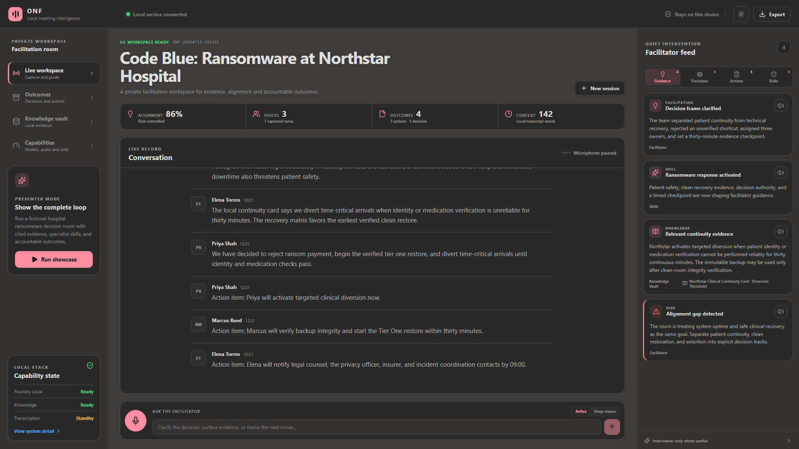
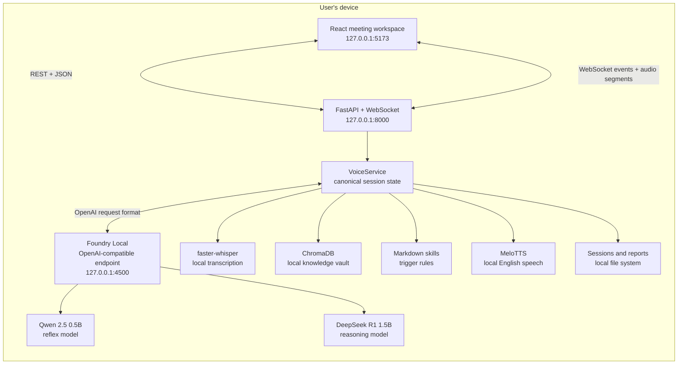

<div align="center">

# Offline Neural Facilitator

### Private meeting intelligence that listens, reasons, facilitates, and records outcomes on your device

**React 19 · FastAPI · Microsoft Foundry Local · Qwen · DeepSeek · faster-whisper · ChromaDB · MeloTTS**

[Why ONF?](#why-onf) · [Architecture](#how-it-is-put-together) · [Dragon comparison](#dragon-copilot-and-onf-different-offline-boundaries) · [Quick start](#quick-start) · [Mobile and edge](#from-desktop-to-mobile-and-edge) · [Demo](#showcase-mode)

</div>



## Why ONF?

Most meeting assistants send audio and transcripts to a cloud service. That is not acceptable for every board meeting, incident response, legal review, healthcare discussion, field operation, or disconnected environment.

**Offline Neural Facilitator (ONF)** explores a different model: the meeting assistant runs beside the user, on the user's own hardware.

ONF turns a live conversation into a private working record and follows one deliberate loop:

> **Capture → understand → intervene → decide → export**

It can:

- transcribe microphone audio locally;
- maintain a readable live meeting record;
- retrieve relevant evidence from an on-device knowledge vault;
- activate specialist facilitation skills when their triggers appear;
- identify decisions, risks, alignment gaps, owners, and next actions;
- answer questions with a fast local model or a deeper reasoning model;
- speak selected guidance through a local English voice;
- save structured sessions and export Markdown, JSON, CSV, and PDF reports;
- keep working without an internet connection after models have been provisioned.

The governing product principles are documented in [COMMANDERS_INTENT.md](COMMANDERS_INTENT.md).

## What the current application includes

| Capability | Implementation | Runtime behavior |
|---|---|---|
| Meeting workspace | React 19 + Vite | Responsive browser UI with conversation-derived titles, transcript, guidance, decisions, actions, risks, exports, and light/dark themes |
| Application API | FastAPI + WebSocket | Loopback-only REST API and live event stream on `127.0.0.1:8000` |
| Fast local intelligence | Qwen 2.5 0.5B through Foundry Local | Quick facilitation, summaries, topic framing, and ordinary meeting questions |
| Deep local reasoning | DeepSeek R1 Distill Qwen 1.5B through Foundry Local | More deliberate analysis for trade-offs, conflict, strategy, and compliance |
| Speech-to-text | faster-whisper `medium` | Lazy-loaded local transcription; runtime downloads are disabled by default |
| Knowledge retrieval | ChromaDB + 384-dimensional feature hashing | Persistent local retrieval without an embedding-model download |
| Specialist skills | Markdown + YAML frontmatter | Trigger-aware facilitator, crisis, strategy, and legal/compliance behavior |
| Speech output | English MeloTTS | Optional, lazy-loaded, and generated locally |
| Session records | JSON + ReportLab + Markdown/CSV writers | Local session snapshots and portable reports |
| Presenter mode | Deterministic backend scenario | Demonstrates the complete product loop even while models are warming |

## How it is put together



### 1. The React workspace

The frontend is not the inference runtime. It is the presentation and control layer.

- `useFacilitator` loads the canonical session snapshot, maintains a resilient WebSocket, and reduces incoming transcript, insight, decision, action, and status events into UI state.
- `useSegmentRecorder` captures complete five-second browser audio segments. Sending complete containers avoids corrupting partial WebM streams.
- The workspace separates conversation from facilitator intervention. Decisions and actions are first-class records rather than text buried in chat.
- Every visible service reports whether it is ready, loading, on standby, or unavailable.

### 2. FastAPI and the canonical session

The FastAPI service owns the local application contract. `VoiceService` is the orchestrator and source of truth for:

- session identity and topic;
- transcript turns;
- facilitator insights;
- risks;
- decisions;
- actions, owners, and due times;
- metrics and exports.

REST is used for commands and snapshots. WebSockets are used for audio segments and live state events. Heavy capabilities are lazy-loaded, so the workspace starts even if speech models are not installed or an LLM is still warming.

### 3. Microsoft Foundry Local

[Microsoft Foundry Local](https://learn.microsoft.com/azure/foundry-local/what-is-foundry-local) supplies the on-device generative-AI runtime.

For this project it provides:

- an OpenAI-compatible local endpoint;
- model acquisition and local caching;
- ONNX Runtime inference;
- automatic selection of a hardware-optimized model variant;
- GPU/NPU acceleration where supported, with CPU fallback;
- no Azure subscription and no per-token cloud service.

The setup script provisions two catalog aliases:

| Role | Foundry alias | Why it is used |
|---|---|---|
| Reflex | `qwen2.5-0.5b` | Small and fast enough for continuous meeting assistance |
| Reason | `deepseek-r1-1.5b` | A compact reasoning model for harder facilitation questions |

At runtime, `FoundryEngine` reads the models exposed by the local service and resolves the best loaded device-specific ID. The application does not need separate inference code for CUDA, WebGPU, NPU, or CPU variants.

The first model and execution-provider download needs internet access. Once cached, prompts and outputs are processed on-device and the application can operate offline. See Microsoft's [Foundry Local architecture](https://learn.microsoft.com/azure/foundry-local/concepts/foundry-local-architecture) and [CLI guide](https://learn.microsoft.com/azure/foundry-local/how-to/how-to-use-foundry-local-cli).

### 4. Local transcription

Browser microphone audio travels only across the machine's loopback interface. The backend writes each complete segment to a temporary file, transcribes it with faster-whisper, adds valid speech to the session, and deletes the temporary file.

The Whisper model is loaded only on first use. `local_files_only=True` is the runtime default, which prevents an unexpected meeting-time download.

### 5. Local knowledge and RAG

Knowledge notes, PDF files, Markdown, and plain text can be added through the UI. The backend chunks them and stores them in a persistent ChromaDB collection.

At startup ONF also idempotently seeds the fictional **Code Blue: Ransomware at Northstar Hospital** evidence pack under `knowledge/demo/`. Headings are retained as section metadata, so a card can cite both its document and the exact section used. The pack is designed for the six-minute live walkthrough in [YOUTUBE_DEMO_GUIDE.md](YOUTUBE_DEMO_GUIDE.md).

ONF deliberately uses deterministic feature hashing for the current retrieval layer:

- 384-dimensional normalized vectors;
- no cloud embedding API;
- no embedding model to download or warm;
- repeatable behavior on modest hardware.

This is lightweight and private, although a future neural embedding option could improve semantic recall where the hardware budget allows it.

### 6. Skills and deterministic facilitation

Skills are Markdown documents with YAML metadata and trigger phrases. When a meeting turn matches a trigger, the relevant instructions are included in facilitator behavior and an activation event is shown in the UI.

The deterministic layer also captures explicit language such as:

- “we decided...”;
- “agreed to...”;
- “action item...”;
- “Priya will...”;
- disagreement and risk phrases.

Canonical decisions and actions are preferred over probabilistic generation when the user asks what the group agreed or who owns the next step. That reduces avoidable hallucination in the most important meeting records.

### 7. Local speech and exports

English MeloTTS is optional. Its package, language assets, and checkpoints are provisioned explicitly and then forced into offline mode at runtime. Generated audio is served back to the browser from the local API.

Sessions are saved under `sessions/`. Reports and portable exports are written locally, by default under `Documents/FacilitatorReports`.

## Privacy boundary

ONF is designed around a visible local trust boundary:

- frontend, API, WebSocket, and model endpoints bind to loopback addresses;
- prompts and model responses are handled by Foundry Local on the device;
- audio transcription and speech synthesis happen locally;
- the knowledge index, session history, and reports are local files;
- there is no application analytics or telemetry SDK;
- CORS is restricted to the local frontend origins by default;
- uploads are type-restricted and limited to 20 MB;
- the runtime blocks implicit Whisper and Transformers model downloads.

Initial setup can access the network to install packages, download models, and obtain hardware execution providers. Foundry Local may also refresh catalog metadata when online. Cached model inference itself is local.

Application files are not encrypted by ONF. Use BitLocker or an equivalent encrypted storage policy for sensitive deployments. The current code/configuration audit is in [privacy_audit_report.md](privacy_audit_report.md).

## Dragon Copilot and ONF: different offline boundaries

[Microsoft Dragon Copilot](https://learn.microsoft.com/industry/healthcare/dragon-copilot/about/) validates the value of ambient capture, structured outputs, trusted information, and human review in high-consequence workflows. It is not, however, an end-to-end offline inference product. Microsoft's [transparency white paper](https://learn.microsoft.com/industry/healthcare/dragon-copilot/whitepapers/transparency) describes Dragon Copilot as cloud-based. Its supported mobile paths can continue recording during a network interruption by storing encrypted audio locally and uploading it when connectivity returns; transcription and generative processing then use the Dragon backend. See the [Android SDK resiliency model](https://learn.microsoft.com/industry/healthcare/dragon-copilot/sdk/ambient/#resiliency) and [embedded mobile resiliency model](https://learn.microsoft.com/industry/healthcare/dragon-copilot/sdk/embedded-mobile/#resiliency).

ONF draws a different trust boundary around the complete workflow:

| Capability | Microsoft Dragon Copilot | Offline Neural Facilitator |
|---|---|---|
| Record during loss of connectivity | Yes, on supported mobile paths; encrypted audio is queued locally for later upload | Yes; browser audio is sent only to the local ONF service |
| Speech transcription while offline | Cloud processing is part of the documented Dragon workflow | Yes; faster-whisper runs on the device |
| Generative summaries and questions while offline | No documented end-to-end offline generation path | Yes; Qwen and DeepSeek run through Foundry Local |
| Knowledge retrieval while offline | Information Assist uses enabled Dragon information sources and services | Yes; curated and user-provided evidence is indexed in local ChromaDB |
| Structured output | Draft notes, flowsheet values, orders, summaries, and other clinical resources | Transcript, cited guidance, decisions, actions, owners, deadlines, risks, and reports |
| Human review model | Clinician review and sign-off are required before filing clinical content | Facilitator remains authoritative; explicit approval/versioning is a planned hardening step |
| System-of-record integration | Strong EHR embedding, partner APIs, data exchange, webhooks, and standard clinical payloads | Local files and exports today; optional system-of-record adapters are future work |
| Identity and administration | Entra ID, licensed users, Dragon admin center, customer environments | Local single-user proof of concept; enterprise identity and policy administration are not yet included |
| Data location | Dragon transmits, processes, and stores encounter data under its Azure healthcare service controls | Meeting data, models, retrieval index, generated audio, sessions, and reports remain on the user's machine |
| Primary design centre | Clinical documentation and workflow optimization for qualified care teams | Private decision rooms, incident command, field operations, legal/board meetings, and disconnected environments |

This is not a claim that ONF replaces Dragon Copilot. Dragon provides a mature healthcare product, clinical workflow integrations, enterprise controls, and a regulated operating model. ONF is an offline-first reference implementation exploring what becomes possible when capture, transcription, retrieval, reasoning, facilitation, and export all remain local.

### Product patterns worth carrying into ONF

Dragon Copilot's public architecture and [integration UX guidance](https://learn.microsoft.com/industry/healthcare/dragon-copilot/sdk/get-started/ux-guidelines) suggest several valuable patterns that do not require adopting its cloud processing boundary:

1. **Encrypted recording spool** — persist each interrupted recording locally with a unique key in platform-secure storage, resume processing safely, and delete it under a defined retention policy.
2. **Session → recording → payload → resource model** — give every recording and generated artifact an opaque correlation ID, timestamp, state, and traceable relationship.
3. **Visible artifact lifecycle** — show `captured`, `secured`, `transcribing`, `generated`, `human edited`, `approved`, `exported`, and `failed/degraded` states.
4. **Draft, review, approve** — treat AI-detected decisions, actions, and reports as proposals until an authorized human confirms or edits them.
5. **Multiple recordings per session** — retain a timestamped recording list, cumulative duration, interruption status, and reprocessing controls.
6. **Consent and purpose gate** — record the lawful/organizational basis for capture, make recording state unmistakable, and include the consent state in the audit record.
7. **Source-scoped guidance** — let users select approved local collections, ask against a named source, inspect the quoted passage, and return “insufficient evidence” when retrieval is weak.
8. **Templates and voice commands** — support repeatable profiles such as incident command, board decision record, legal review, or downtime handover, plus deterministic commands such as “mark that as a decision.”
9. **Output feedback and versioning** — attach corrections to the exact output, preserve revision history, and build a local evaluation set from accepted and rejected suggestions.
10. **Local Responsible AI pipeline** — add intent classification, scoped retrieval, unsupported-claim checks, human review, and evaluations for groundedness, completeness, relevance, factuality, owner accuracy, and citation correctness.

The strategic distinction is concise:

> **Dragon Copilot provides resilient offline capture before cloud processing. ONF is designed for offline capture, transcription, retrieval, reasoning, facilitation, and export.**

## From desktop to mobile and edge

The core premise of ONF is broader than one Windows workstation: **small, quantized models can move to the user instead of moving the user's meeting to a remote model**.

Microsoft describes Foundry Local as a lightweight on-device runtime built on ONNX Runtime, with model variants selected for the available CPU, GPU, or NPU. The current Foundry Local documentation supports Windows, macOS on Apple silicon, and Linux, and its SDK is designed for device-hosted client applications.

### What is portable already

The project is separated into boundaries that can move independently:

1. **Presentation** — the React interface is responsive and can be hosted in a desktop shell, tablet browser, PWA, or native WebView.
2. **Session contract** — transcript, insight, decision, action, and risk events are plain JSON over REST/WebSocket.
3. **Model contract** — the application uses OpenAI-compatible requests and Foundry model aliases rather than hard-coding one accelerator.
4. **Model format** — Foundry's optimized models run through ONNX Runtime, whose model format is designed for execution across cloud, desktop, edge, and mobile-class hardware.
5. **Storage** — sessions and knowledge are local and can be mapped to SQLite or a platform sandbox.

### What a native phone port still requires

This repository is the **Windows reference implementation**. It is browser-responsive, but it is not currently an installable iOS or Android application. A native mobile edition would need to:

- replace the PowerShell/Python host with a platform-native process or supported embedded runtime;
- use Foundry Local where the target platform is supported, or package compatible quantized ONNX models with ONNX Runtime Mobile;
- replace ChromaDB with a mobile-safe local index or SQLite implementation;
- use the platform microphone, background-execution, storage, and permission APIs;
- select smaller ASR/TTS models appropriate to phone memory, battery, and thermal limits;
- benchmark latency and quality on representative Apple, Qualcomm, MediaTek, and Samsung hardware;
- preserve the same local-only consent, retention, and export controls.

So the architecture is intentionally **mobile-capable in premise and portable in layers**, while the code in this repository remains an honestly scoped Windows implementation. No claim is made that this exact `.ps1` + FastAPI stack can be installed unchanged on every phone.

For background on portable model execution, see [ONNX and cross-platform inference](https://learn.microsoft.com/azure/machine-learning/concept-onnx) and the [Foundry Local SDK reference](https://learn.microsoft.com/azure/foundry-local/reference/reference-sdk-current).

## Quick start

### Prerequisites

- Windows 10/11
- Python 3.12
- Node.js 18+
- Microsoft Foundry Local CLI
- a modern Chromium browser
- FFmpeg for live transcription
- a DirectX 12-capable GPU recommended; CPU fallback is available

Install Foundry Local:

```powershell
winget install Microsoft.FoundryLocal
```

### Install the core application

```powershell
git clone <your-fork-or-repository-url>
cd "Offline Neural Facilitator ONF Foundry Local - Poc"
.\scripts\setup.ps1
```

The setup script installs Python and frontend dependencies, starts Foundry Local, and caches Qwen 2.5 0.5B plus DeepSeek R1 1.5B.

To include local transcription and English speech:

```powershell
.\scripts\setup.ps1 -WithAudio
```

This additionally provisions faster-whisper, the Whisper `medium` model, pinned MeloTTS code, English BERT assets, and the MeloTTS English checkpoints.

If models are already cached:

```powershell
.\scripts\setup.ps1 -SkipModels
```

### Launch

```powershell
.\scripts\start.ps1
```

Open **http://127.0.0.1:5173** if the browser does not open automatically.

Useful launch modes:

```powershell
.\scripts\start.ps1 -NoBrowser
.\scripts\start.ps1 -SkipFoundry
```

`-SkipFoundry` still allows the deterministic showcase, structured outcome capture, knowledge vault, and exports to run.

## Showcase mode

Click **Run showcase** in the left rail. In roughly eight seconds ONF runs a fictional hospital ransomware decision room that demonstrates:

1. a disagreement about patient continuity and clean recovery;
2. an alignment-gap intervention;
3. cited local clinical-continuity and recovery evidence;
4. ransomware-response skill activation;
5. one recovery decision;
6. three next actions with named owners and times;
7. a locally exportable session record.

The showcase does not depend on an LLM response, so it remains reliable while models are loading and is suitable for demos and recordings. A camera-ready walkthrough is provided in [YOUTUBE_DEMO_GUIDE.md](YOUTUBE_DEMO_GUIDE.md).

## Validation

With the application running:

```powershell
py -3.12 smoke_test_v2.py
py -3.12 test_triggers.py
npm run lint
npm run build
```

The canonical smoke suite verifies health, privacy state, WebSocket events, the full showcase, local facilitator queries, session persistence, and JSON/Markdown/PDF exports.

## Repository layout

```text
backend/
  main.py                         FastAPI routes, WebSocket, uploads and exports
  llm/foundry_manager.py          Foundry Local health, model resolution and inference
  services/
    voice_service.py              Session orchestration and deterministic facilitation
    transcription_service.py      Lazy local faster-whisper ASR
    rag_service.py                ChromaDB and network-free feature hashing
    skill_service.py              Markdown/YAML skill loading and triggers
    tts_service.py                Lazy offline English MeloTTS
    report_service.py             JSON, CSV, Markdown and PDF output

frontend/
  src/App.jsx                     Application workflow orchestration
  src/components/                 Workspace, facilitator feed, chrome and dialogs
  src/hooks/useFacilitator.js     REST/WebSocket state client
  src/hooks/useSegmentRecorder.js Complete browser audio segments
  src/lib/api.js                  Local API configuration

scripts/
  setup.ps1                       Reproducible core/optional-audio setup
  start.ps1                       Foundry + backend + frontend launcher

skills/                           Built-in facilitator skill definitions
knowledge/demo/                   Fictional, section-cited Code Blue evidence pack
screenshots/                      Public repository imagery
smoke_test_v2.py                  Canonical full-stack smoke suite
test_triggers.py                  Deterministic extraction checks
COMMANDERS_INTENT.md              Product mission and non-negotiable constraints
ROADMAP_v2.md                     Honest delivery roadmap
```

Large models, audio checkpoints, local knowledge, generated speech, ChromaDB data, and session history are intentionally excluded from Git.

## Current limitations

- The reference launcher and tested implementation target Windows.
- Native iOS and Android packaging is a future port, not a current deliverable.
- Speaker identity/diarization is not currently claimed or included.
- Feature-hash retrieval is intentionally lightweight and is less semantically capable than a neural embedding model.
- English is the only supported local TTS language in this build.
- Model quality and latency depend on the selected device variant and available memory.
- Foundry Local and its CLI are evolving; consult the current Microsoft documentation when upgrading.

## Roadmap

See [ROADMAP_v2.md](ROADMAP_v2.md) for reliability, facilitation-quality, packaging, mobile/edge, and deployment-hardening work.

## License

Released under the [MIT License](LICENSE).

---

<div align="center">

**Sensitive conversation in. Evidence, alignment, and accountable action out — without sending the meeting away.**

</div>
